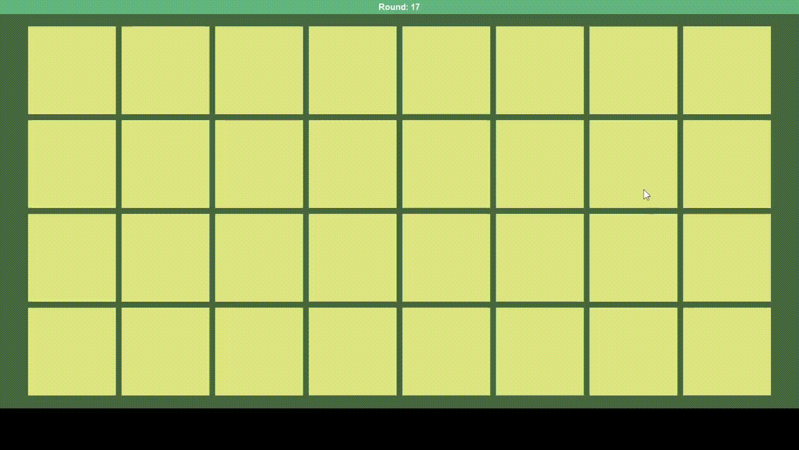

# Memory Game

This is a memory game with animals from brazilian fauna developed by me from scratch so I could put in practice everything I was learning about Tkinter.

Despite it being a really simple game, with not much code, it really taught me stuff during its development. Like: do you know you can't use `time.sleep()` to block your Tkinter app for some time? And if you wanna do something after some moment you should use the `after` method from `tk.Tk`.

## Demo
---

## To play
---
It can be downloaded [here](https://drive.google.com/file/d/1aeVji0Ts57jStRVHaN8tOl-epIFyZwvD/view?usp=sharing). Then you extract the files and execute `memory-game.exe`.